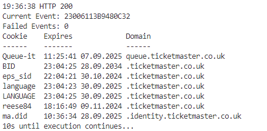

track availability of tickets for events from ticketmaster.co.uk

# How it works
1. open new tab for ticketmaster.co.uk in running Mozilla Firefox instance
2. retrieve ticketmaster.co.uk cookies from running instance
3. call Ticketmaster API
4. write response to /logs/tracking_history.csv and /logs/tracking_history.jsonl
5. if ticket is available, response with ticket details will be written to /logs/picks.json
6. when cookies expire after about 15 Minutes, start from beginning

# Requirements

- Running Mozilla Firefox Instance
- Python 3
- [Tab Wrangler Addon](https://github.com/tabwrangler/tabwrangler/) (optional)

# Ticketmaster API

API to retrieve  list of available tickets of an event

## Endpoint

/api/quickpicks/<EVENT_ID>/list

## URL Parameters

|Name|Value|Description|
|----|-----|-----------|
|EVENT_ID|23006130DAB40C0B|ID of  Event|

### How to get Event ID

## GET Parameters

|Name|Value|Description|
|----|-----|-----------|
|resale|true|if true, only resale tickets will be returned|
|qty|1|number of tickets you're looking for|
|offset|0|position from where to start returning results|
|limit|100|number of maxium returned results|
|sort|price|attribute to sort results|
|primary|true|n/a|
|defaultToOne|true|n/a|
|tids|000000000004|n/a|

## Request Headers

see [sample.config.json](samples/sample.config.json)

## Cookies

### Required

|Name|Domain|
|----|------|
|BID|.ticketmaster.co.uk|
|eps_sid|.ticketmaster.co.uk|
|language|.ticketmaster.co.uk|
|reese84|.ticketmaster.co.uk|

### Others

|Name|Domain|
|----|------|
|Queue-it|queue.ticketmaster.co.uk|
|cf_clearance|.help.ticketmaster.co.uk|
|ma.did|.identity.ticketmaster.co.uk|

## Response

### HTTP Status Codes

|Status|Descripton|How Tracker handles it|
|------|----------|----------------------|
|200|Request successful|write response to logs\\<EVENT_ID>.csv|
|401|Cookie expired|write status to logs\\<EVENT_ID>.csv, retrieve new cookie|
|403|Headers invalid|write error to logs\\<EVENT_ID>.html, cancel execution|
|404|Event not found|write error to logs\\<EVENT_ID>.html, cancel execution|
|503|Event temporarily not available|replace failing event id with new event id|
|504|Timeout|replace failing event id with new event id|

### Body when no Ticket is available

```
{
	"quantity": 0,
	"total": 0,
	"picks": [],
	"descriptions": []
}
```

### Body when 1 Ticket is available

```
{
	"quantity": 1,
	"eventId": "23006113B5E30BFD",
	"total": 1,
	"picks": [
		{
			"id": "lg899kjn6",
			"type": "general-seating",
			"section": "PITCH",
			"originalPrice": 396.93,
			"description": "",
			"areaName": "",
			"placeDescriptionId": "IE5DCNJMHE",
			"hasSpecialDescription": false,
			"offerIds": [
				"HF6GYZZYHE4WW2TOGY"
			],
			"snapshotImageUrl": "image?systemId=HOST_UK&segmentIds=s_168",
			"quality": 0.97235,
			"sellerBusinessType": "private",
			"resaleListingId": "lg899kjn6",
			"sellerAffiliationType": "unaffiliated",
			"attributes": []
		}
	],
	"descriptions": [
		{
			"id": "IE5DCNJMHE",
			"descriptions": [
				"No U14s. Under 18s with adult 18+",
				"Incl. 2.75 Facility Fee"
			]
		}
	]
}
```

## Subdomains

- www.ticketmaster.co.uk
- queue.ticketmaster.co.uk
- identity.ticketmaster.co.uk
- help.ticketmaster.co.uk

# Schema tracking_history.csv

uses [CSV Format](https://datatracker.ietf.org/doc/html/rfc4180)

each line represents the availability at the given time

**Sample:**
|quantity|total|picks|descriptions|status|eventId|time|date|
|--------|-----|-----|------------|------|-------|----|----|
|0|0|[]|[]|200|23006130DAB40C0B|23:59:59|01.01.2024|

# Schema tracking_history.jsonl

uses [JSON Lines Format](https://jsonlines.org/)

each line represents the availability at the given time

**Sample:**
```
{"quantity": 0, "total": 0, "picks": [], "descriptions": [], "status": 200, "eventId": "23006130DAB40C0B", "isoDate": "2024-01-01T23:59:59.999999"}
```

# Schema picks.json

uses [JSON Format](https://datatracker.ietf.org/doc/html/rfc8259)

each object represents unique available pick for a single event at the given time

**Sample:**
```
{
	"picks": [
		{
            "id": "lwchvgnt4",
            "type": "general-seating",
            "section": "PITCH",
            "originalPrice": 395.42,
            "description": "",
            "areaName": "",
            "placeDescriptionId": "IE5DCNJMHE",
            "hasSpecialDescription": false,
            "offerIds": [
                "HF6GY53DNB3GO3TUGQ"
            ],
            "snapshotImageUrl": "image?systemId=HOST_UK&segmentIds=s_168",
            "quality": 0.97235,
            "sellerBusinessType": "private",
            "resaleListingId": "lwchvgnt4",
            "sellerAffiliationType": "unaffiliated",
            "attributes": [],
            "eventId": "23006130DAB40C0B",
            "isoDate": "2024-01-01T23:59:59.999999"
        },
        {
            "id": "lwhdbh7jv",
            "type": "seat",
            "section": "120",
            "row": "24",
            "seatFrom": "243",
            "seatTo": "244",
            "originalPrice": 540.18,
            "description": "Level 1",
            "areaName": "L1",
            "placeDescriptionId": "IE5DCNRMHE",
            "hasSpecialDescription": false,
            "offerIds": [
                "HF6GY53IMRRGQN3KOY"
            ],
            "snapshotImageUrl": "image?systemId=HOST_UK&sectionNames=120&placeId=GEZDAORSGQ5DENBU",
            "quality": 0.88172,
            "sellerBusinessType": "private",
            "resaleListingId": "lwhdbh7jv",
            "sellerAffiliationType": "unaffiliated",
            "attributes": [],
            "eventId": "23006130DAB40C0B",
            "isoDate": "2024-01-01T23:59:59.999999"
        }
	]
}
```

# Configuration

create config.json with following attributes:

|Name|Description|Available Values|
|----|-----------|----------------|
|firefox_executable|absolute path to Mozialla Firefox executable|n/a|
|selenium|NOT IMPLEMENTED YET!|chrome, firefox|
|cookies|Cookie String or cookies.txt File, if empty Cookie from running Firefox instance will be used|String: "eps_sid=XXX; BID=XXX; reese84=XXX; SID=XXX; sticky=XXX", File: [sample.cookies.txt](sample/sample.cookies.txt)|
|headers|Array of required Request Headers|see [sample.config.json](sample/sample.config.json)|
|domain|Ticketmaster domain|.ticketmaster.co.uk|
|api_path|API path|/api/quickpicks/|
|primary_events|Array of Event IDs which will be tracked|see [sample.config.json](sample/sample.config.json)|
|secondary_events|Array of Event IDs which will be used if primary Event fails|see [sample.config.json](sample/sample.config.json)|
|method|API method incl. query parameters|list?resale=true&qty=1&offset=0&limit=100&sort=price|
|request_delay|delay between requests (in seconds)|30|
|refresh_delay|delay until new loaded cookies will be used (in seconds)|15|
|picks_list|JSON Array with all found tickets|picks.json|
|response_sample|load API response sample for testing|see [list_ticket.json](samples/list_ticket.json)|

for further sample values see [sample.config.json](sample/sample.config.json)

# Console Output



**Line 1:** Execution Time (hh:mm:ss) HTTP Status \
**Line 2:** Current Event ID \
**Line 3:** Number for Events which returned HTTP 503 or 504 \
**Line 4 - 12:** Table of used Cookies including Name, Expiration (hh:mm:ss dd.MM.YYYY) and Domain \
**Last Line:** Countdown until the Execution continues

# Testing

## Scripts

[curl.bat](testing/curl.bat) - basic cURL command of sample request from Chrome Dev Tools

[request_session.py](testing/request_session.py) - simple Python request sample with hardcoded headers and cookies

## Load Response Sample

## Load Cookie String

## Load cookies.txt

# To-Dos

- implement headless browser
  - selenium
  - playwright
- write results to SQLite
- add UI to view results